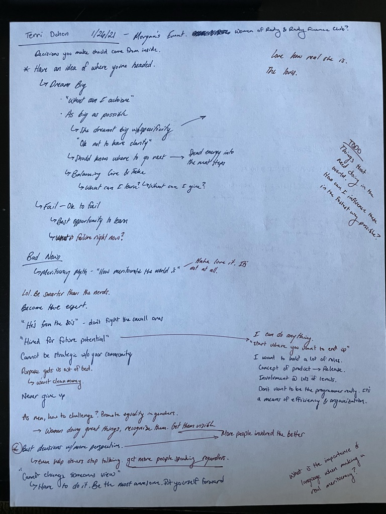
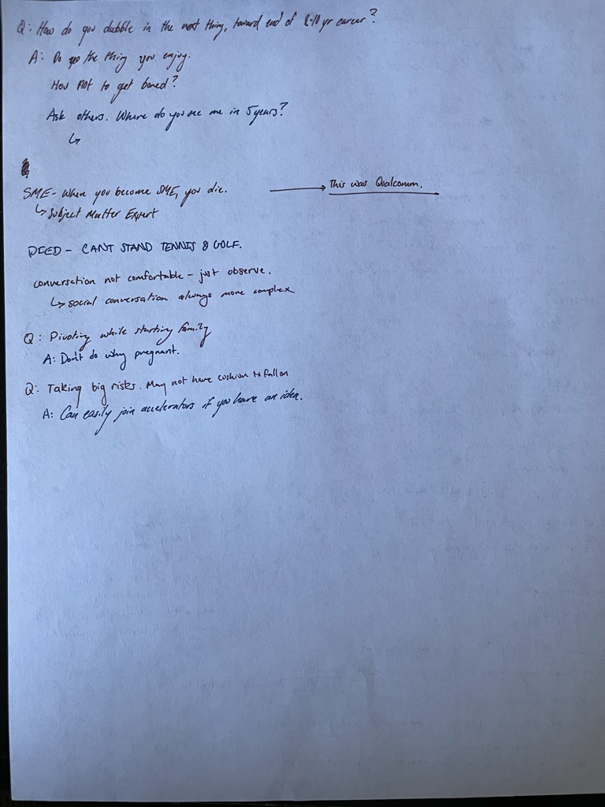

# Tuesday, January 26, 2021

## Events

### 8AM - 9AM: Terri Duhon. Morgan's event, Women of Rady & Rady Finance Club

Lot's of interesting things during this. Really getting me thinking about really
what I am trying to do in my own life. What are my big goals? How to make
those a reality. Besides the smaller things I want, what are the big things and
how can I chart a path to get there in some way. What will it require? If I want
something how can I be there today and start learning to do that the best I can?

What is it that I want in a job anyway?

Well I want to be able to play with code, but not in the capacity of actually 
building something with it, but using it to make things more efficient. To 
organize information with it

#### Notes

## Projects

### Natural Language Processing

Really this is a thought from yesterday. I don't actually want to organize the
data in my brain in a computer system. This is a heinous task to try to do.
However I would want to collect a large amount of data that is semi-structured
and have the computer be able to operate on this to answer questions. I would
love to have this simple markdown text be able to be understood in the greater
context of things. I am wondering how to make that possible.

For now I guess I don't mind structuring some data so I can manually query some
information, but really eventually I want to write some tiny sentences to 
describe to a computer what I want and actually get the result out.

I think I will need to understand machine learning in much greater detail. I 
think I might need to brush up on the fundamentals of the field and basically
give myself a crash course in ML. Reading the fundamental research papers and 
directly playing with the techniques they are talking about. From computer
vision research kind of things (labeling) to natural language processing and
the latest in transformers. Really the problem I am trying to solve seems
like artifical general intelligence. To have a computer be able to reason about
the world in a way similar to me, so we can achieve symbiosis. To be able to look
at things potentially from an rational point of view. But really I am just a
giant sense organ with some directions I want to put myself in. I want to go
climb and the AI behind it should be helping me every part of the way. Same
thing with everyone I talk to etc. A real personal assistant integrated into the
way I live. But this must be built of personal and independent data. It can take
data in from other people, but it needs to be 'local'. Whatever that means