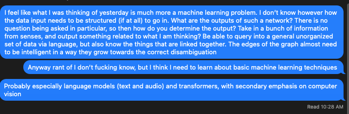

# Tuesday, January 26, 2021

## Events

### 8AM - 9AM: Terri Duhon. Morgan's event, Women of Rady & Rady Finance Club

Lot's of interesting things during this. Really getting me thinking about really
what I am trying to do in my own life. What are my big goals? How to make
those a reality. Besides the smaller things I want, what are the big things and
how can I chart a path to get there in some way. What will it require? If I want
something how can I be there today and start learning to do that the best I can?

What is it that I want in a job anyway?

Well I want to be able to play with code, but not in the capacity of actually 
building something with it, but using it to make things more efficient. To 
organize information with it. 

Mostly to use code as a tool in my toolbox to make informed decisions, 
and do it in a way that is effective and helps the planet and human
community as a whole.

Really I would like to be in a position of power. I think we know this and
have said this many times to myself. To tell the industry to go fuck itself
and start working with everyone. To build community and divert away from
insular fanatics. There are a lot of problems I think are important and
want to work to fix these problems with brilliant minds. To be able
to understand a wide range of topics deeply, to have indepth conversations
and make informed decisions. 

To me this doesn't sound much like code. Code is one avenue of getting 
here but probably not the only one. In one way it would be something
like being president, but also fuck politics. That is even worse.
But I do want to be with other people who are thinking about all
these complex problems and driven to solve them as best as possible.

I want to effect change at a large scale. But I guess even now I am running
into problems of trying to even get change at a small scale. Well rather
I think I picked the wrong challenge. Working through the real problem,
I think it is becoming more clear to evaluate problems by asking more questions.
Coming up with a hypothesis of the problem, then go out into the world to see
if that is actually the problem. Turns out computers are not the problem in 
the US. Is internet access actually a problem around the world? Not totally
sure, but education is actually a problem.

Really what is the future of digital learning? I think this is an important question
especially after the COVID pandemic. I think there is going to be a greater focus
on this. How do we do digitally learning effectively and keep students engaged?

This is one of the fundamental problems facing us right now. Might need to try
to find other people who are working in this space. I think the contacts I have
are great but might need to explore the Ed-Tech space further. Especially
more equal access to good technology. Funding for programs to make education better.
Funding to help get students to college. 1-1?

#### Notes

## [[Projects]]

### [[Natural Language Processing]]

Really this is a thought from yesterday. I don't actually want to organize the
data in my brain in a computer system. This is a heinous task to try to do.
However I would want to collect a large amount of data that is semi-structured
and have the computer be able to operate on this to answer questions. I would
love to have this simple markdown text be able to be understood in the greater
context of things. I am wondering how to make that possible.

For now I guess I don't mind structuring some data so I can manually query some
information, but really eventually I want to write some tiny sentences to 
describe to a computer what I want and actually get the result out.

I think I will need to understand machine learning in much greater detail. I 
think I might need to brush up on the fundamentals of the field and basically
give myself a crash course in ML. Reading the fundamental research papers and 
directly playing with the techniques they are talking about. From computer
vision research kind of things (labeling) to natural language processing and
the latest in transformers. Really the problem I am trying to solve seems
like artifical general intelligence. To have a computer be able to reason about
the world in a way similar to me, so we can achieve symbiosis. To be able to look
at things potentially from an rational point of view. But really I am just a
giant sense organ with some directions I want to put myself in. I want to go
climb and the AI behind it should be helping me every part of the way. Same
thing with everyone I talk to etc. A real personal assistant integrated into the
way I live. But this must be built of personal and independent data. It can take
data in from other people, but it needs to be 'local'. Whatever that means

Will really need to think about the output of the program, or really if it's a
hypernetwork of machine learning models, each which are specific to certain 
kind of outputs and the top level one is just delegating to smaller subtasks

This is also something Geore Hotz talked about in Comma.ai with Lex Fridman I 
believe. <- For example that certainly should be linked to the podcast itself
which I do have in a database somewhere. It is just a graph with nodes and edges.
Can the whole graph just be arbitrary? I think that is how I would like to
structure data in a way.

How can a computer organize the data for itself more effectively than I can?
Some kind of CDN? Optimizing paths of access? Is this something that you 
should go and get a PhD for?

### [[Young Futures]]

After a lot of conversation the bigger problem that I am seeing is not
necessarily a lack of access to computers. But really the problem is lack
of computer science education in K-12 schools across the nation. Would 
love to quantify this. 

## Etc

Just so you know. A tag NEED NOT BE A FILE. That seems like a really silly thing
to enforce. Somethimes it's just a piece of data goddamnit.

### Interesting UCSD Courses

CSE222A/B: Computer Communication Networks
CSE 232/B/233: Databases
CSE 250-254/256-258