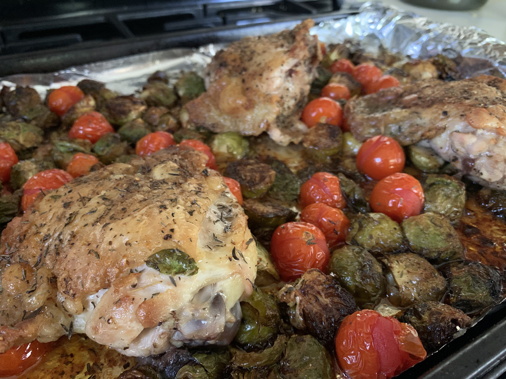
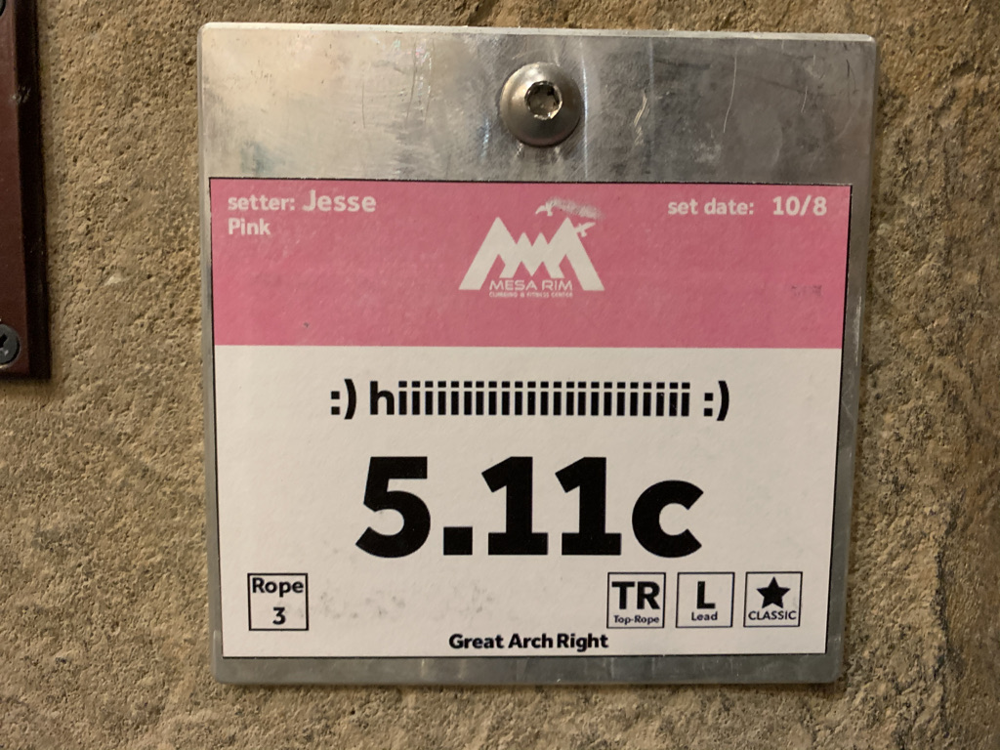

# Wednesday October 14th, 2020

## Morning 🌅🌊🏊🏼🐬
Went for another ocean swim with Katie, hoping to see some Leopard Sharks by the Marine Room.

### DOLPHINS
Unfortunately didn't see any sharks, however we did run into
a pod of Dolphins (yes DOLPHINS!) while swimming out. The sunrise and morning light was absolutely fantastic. There was a little fog out looking north to Del Mar, and just beautifulness looking towards the Cove. Ugh. Amazing light. Wish I had my phone with me swimming. 

### Spacetime and the Ocean's Surface

Katie brought up something quite interesting and something to chew on more. We were just floating in the middle of the ocean (over about 88ft). Looking over the horizon, you can pay attention to the surface of the water. In a way you literally are seeing waves create and destruct eachother in real time. She compared this to spacetime. How different is this than spacetime? In some sense it's not. It is spacetime. 

Conceptualizing it, if you look at the surface of the ocean, it's really like a plane (well really a surface itself). And perhaps just following the flow of a vector field. However this is continuously changing in time. Anyhow to simplify. Maybe to imagine spacetime, I am zooming out. Looking at the earth. You can take a plane much like:

However this is really oversimplifying the shit out of this. This looks NOTHING like the oceans surface. This is imagining the plane as a fabric, which okay to some degree is true. However that is a massive oversimplification because that fabric is being stretched from my different directions simultaneously. Even in micro amounts, however those micro amounts have ripple effects and could end up creating a huge peak or trough somewhere no? So really looking at this as a plane I imagine it completely opaque to begin with. Then you start adding elements to it. Immediately you would start to see tons and tons of holes as you are just looking at a slice (not the surface itself as shown here). Now taking infinite slices you start to build the whole picture. But what do these slices look like for the Earth? Like how does it pass through? Does it? Do we just have a hole? What? Anyway this requires a lot more thinking. Would like to draw and discuss this more with Katie. 

I also know nothing about spacetime so this is all intuition, if you know something or just want to talk PLEASE contact me <cj@cjpais.com>

The waves of the ocean are certainly manifestations of spacetime. It's a small example of the chaos that forms out of this very simple thing (well relatively simple). It's amazing to watch the surface of the ocean and see the near infinite complexity

### Flying in the Ocean

Ummm so most humans can't fly. I mean there are people that [Base Jump](https://en.wikipedia.org/wiki/BASE_jumping) which is pretty damn close. 

As Katie mentioned, the ocean is also sick in the sense you can 'fly' in it. You are operating in a much more 3D world than compared with the normal life on Earth's surface. It's quite incredible to be in the ocean. Think about it. 

## [cjpais.com](https://cjpais.com)

Made a minor update to my website today. Before it was pointing to the [stream](https://stream.cjpais.com), but today it's more a landing page. Just keeping it nice and simple for now. Just a bunch of links to things I am doing and working on. 

[IBM Plex Mono](https://www.ibm.com/plex/) is ❤️

### 🐣
There are some rotating pictures if you stay on long enough. After 60sec they start to rotate randomly under the function: `f(x) = max(x/2, 750)`. This means the fastest it will change is every 750ms.

### More CSS Pain

Sometimes I just wish things were easier yknow. It was so much effort to square crop an image and then make a circle over it. It seemed like the best way to go about this was going to be use `object-fit: cover`. This is supposed to essentially crop the image even if it is non-square. But for me it didn't work for every image. It worked for many but not all, so that was a bummer. It kept leading the image to be stretched when using `object-fit: cover;`.

I tried a few different things, css `background-image`.... Ultimately after playing around with css I just decided it'd be easier to square crop every image by default so then I don't have to think. Turns out this worked great.

## Austin Call

Great talking with Austin as always. Seems like his goals are going well and this week is going much better. Really excited to continue to see what he is doing on [YouTube](https://www.youtube.com/channel/UCcgdt0edaWlKEpUwPtXCrhg). Very excited for him to kill flight school as well.

We talked about some of the stuff on the [homepage](https://daily.cjpais.com). Think he started to read the latest one which was cool. Discussed about the new iPhone's, he watched the event. 

Homepod mini. 

iPhone Mini vs iPhone Pro. 

Selling some of my QC stock. I am planning on selling 17 at $135 as mentioned yesterday. I hold in total 259. This is about 7% of my holdings. I discussed a little bit the rationale here. I am not sure about QC in the long term. I mean it seems like they are in a fantastic (and monopolistic) spot at the moment. But there are a few concerns I have. 

The first is that Apple will not be sticking with Qualcomm indefinitely. They are trying to build their modem division ([look at their jobs page](https://jobs.apple.com/en-us/search?search=5g&sort=relevance&location=united-states-USA)). Given the success of their CPU division and the fact they took Intel's I'd bet they will do well. This means that Qualcomm will lose a good amount of $$$ when Apple goes to their in-house solution. A lot of people in QC think that Apple won't be able to pull this off due to the complexity of a modem. But I am less convinced. It is very complex, but as humans we understand these things pretty well. The nr spec is an insanity nightmare hellzone because of the ambiguity, but regardless I think they can pull this off. 

The second thing is that I don't know why we are not selling SW upgrades for modems. This would allow for us to keep our devices much longer and still benefit from improved speeds if we want. From what I've seen in the SW I believe this is 1000000% possible and would be an amazing change for the industry, the environment, and potentially for people too. There of course are some hardware reasons why this is not always possible. But regardless after seeing the power of [SDR's](https://en.wikipedia.org/wiki/Software-defined_radio), I wonder how we can simplify the stack with SW instead of HW where it is not needed. 

Perhaps I wasn't in the industry long enough to really be accurate here. I do understand why we need HW. But from what I have seen the HW is quite software upgradable. Open Source modem HW anyone? And perhaps what I was saying is not quite clear yet, I think I had a good train of thought with Austin, but it needs to be clarified more. Anyway.

If you are interested in making software upgradable modems, let me know. I'd be interested to work with you. I think there is a huge potential to innovate in this space and completely wipe out Qualcomm. There is also so much more that we can do with radios that are just not exposed to the OS right now. Just a little shift in this could have massive impacts in the industry I believe. This is one industry that could definitely be done more responsibly and look deeper into the future. 

## Lunch

Needed to make some food. Something real simple. Some chicken, salt, pepper. With roasted brussel sprouts (garlic powder, olive oil, salt, pepper, cayenne, smoked paprika) and tomatoes. Simple and delicious. Literally was licking my plate clean afterwards. Maybe I was just hungry.

## RBG

Gotta do that 10 minutes :)

Went over "general applicability" which was an extra statement in RFRA which I didn't understand.
Seems to be laws that do not necessarily target First Amendment Rights, but can be applied in that context. They are "generally applicable" as they can apply in many contexts outside of this as well.

Also tried to summarize the case. I need to work on the phrasing of it. Not sure to phrase from Burwell (HHS) or Hobby Lobby side.
Need to pay close attention to what the lay is actually stating here as well.

## do you even climb bro?

Fuck yeah more climbing. A bike ride before climbing is the best warm up. Also it is the best warm down. I feel so good after.
I FLEW home. Track standed through every light like it was nothing. lol.

Climbing was really good today too. 10b flash, 11a flash, 12a flash, 11c flash, 9 flash. Easy peasy. Mira Mesa sets easier for sure.
That 12a was not a 12a, must've been 11c or d. 

ANYWAY WAS SIIIIIIIIIIIIIIIIICK

### :) HIIIIIIIIIIIIIIIIIIIIIIIIIIIIIIIIIII :)

wicked fun climb

## TBD

### Save -> Commit -> Push publishing

Basically I don't want to think about ever committing something to the repo. That is all. Need to modify the script.
This has some added benefits as well.

### Update index to include monday, tues... for the current week