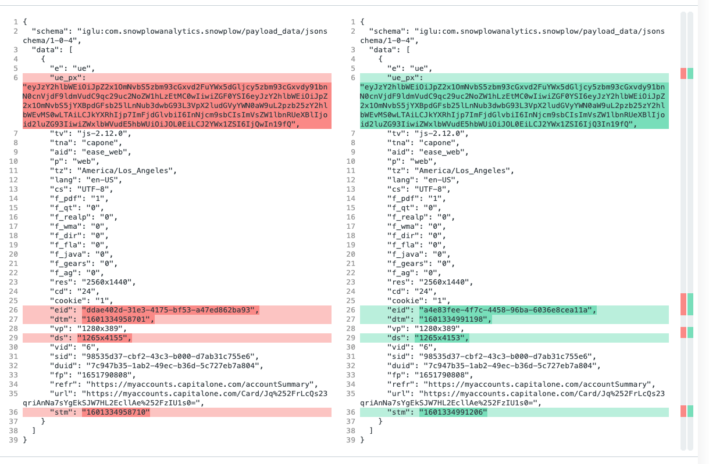
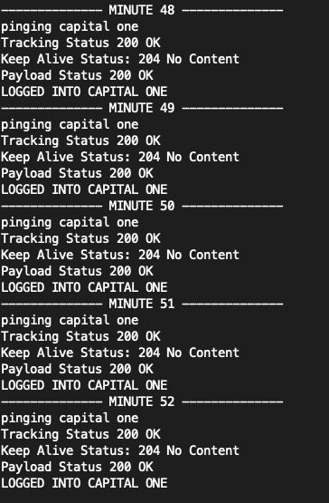

# Monday September 28th, 2020

## Summary

* ~2mi Run. Felt good on the knee overall, slower than I'd like though
	* I blame the KBBQ 😝
* [John Oliver Supreme Court](https://www.youtube.com/watch?v=pkpfFuiZkcs)
* Read *United States v. Virginia*
* Financials
	* Started dissecting Capital One API 

## RBG

### *United States v. Virginia*

Very interesting reading. I definitely seem to agree with the majority opinion however Scalia does have a very interesting dissent. Quickly started reading about some of the aftermath as part of this decision. Will need to read more to fully understand. 

For context this decision is about an all male public school (VMI [Virginia Military Institute]) which denied access to women. They had some particular schooling techniques that certain women would like to take advantage of, but were denied. The basis of most of the argument hinges on the Equal Protection Clause of the 14th Amendment.

#### [My Marked Up Copy](us_v_virginia.pdf)

## Financials

### Getting Capital One Transaction Data

On Friday I discovered Plaid does not have great support for Capital One. Unfortunately one of my primary Credit Cards is a Capital One card. It looks like there is some political battles being fought between Visa and Mastercard or something. Plaid is now owned by Visa, and Captial One is primarily a Mastercard shop. I am not a fan of this.

Anyway I needed to figure out some workaround to get my transaction data. Good thing is you can always take a peek at the network requests being sent to the Capital One server's from the dev console. After a few minutes of looking I spotted the one I wanted. 

`https://myaccounts.capitalone.com/ease-app-web/CreditCard/v2/accounts/<account_id>/transactions?endDate=2020-9-28&startDate=2020-8-5`

This returns a nice JSON response. The only caveat is that you need to request it with your login cookie otherwise you will just get an HTML response telling you to log in. So I just quickly picked my cookie, put it into a config file and wrote a quick script to query the data every 5 minutes. 

After giving this a test I found out this was not enough. I suspected that this might be the case since on the page it would eventually request me to log out, then log me out after inactivity. Now I was wondering if there was some tracking data going back to the server which might prompt this. I did find some requests going out all the time (even when I typed.. this was unnerving.. basically a keylogger). There was a POST going to the URL:

`https://potomac-clickstream.capitalone.com/com.snowplowanalytics.snowplow/tp2`

I naively made the assumption if I just copy the payload data and send the request it might be okay. Now I wait for this experiment to run. In the meantime it would be good to explore the diff between the two to see what I might need to modify.



It looks like there are only a few things that are different. It seems straightforward to deconstruct

* `stm` - Seems to be the time the request was sent in ms since epoch
* `ds` - Unimportant but probably "Display Size"
* `dtm` - Event action time? This is also ms since epoch
* `eid` - Event identifier. I believe the client (browser) is generating this. A UUID
* `ue_px` - I assume this is the real tracking payload. It seems base64 encoded, so I decoded it and got this:

```
{
  "schema": "iglu:com.snowplowanalytics.snowplow/unstruct_event/jsonschema/1-0-0",
  "data": {
    "schema": "iglu:com.capitalone.snowplow/ui_interaction/jsonschema/1-0-0",
    "data": {
      "action": "scroll",
      "elementType": "window",
      "elementName": "N/A",
      "value": "47"
    }
  }
}
```

Great. So now I know exactly how to replicate events going to their system if I need to. 

As I am writing this so far I have lasted 20 minutes logged into their system. This is looking promising. Before after 15 minutes I was logged out. While this continues to run I am going to start separating out clients.

Welp. That did not work either. I am now going to fake some of the data. The timestamps and UUID's are going to get generated. I am also just going to fake some scroll events too and make sure they are changing ever so slightly. In parallel I want to get a network recording of this page. Hopefully I can detect when it thinks I am inactive as well. Then when I clearly click IM ACTIVE, I can see what the heck that is doing to make sure the server knows. I can just try to force keep it alive. 

Coming back after about an hour. I did fake the data. I am not sure if this is necessary or not (but I don't mind giving Capital One some crappy data). While I was programming the fake data generation I noticed there was a keep-alive URL. I figured hmmm it might be good to GET that too. 

`https://myaccounts.capitalone.com/ease-app-web/customer/keepalive`

With this and the fake data I have been able to sustain a connection without too much issue so far. 



#### Code is [here](https://github.com/cjpais/howmanyburritosleft/blob/main/private-backend/main.go)

### Getting Apple Card Transaction Data

Similar to Capital One there is no real easy way to get transaction data programmably. You can however export a .csv of the previous month's statement. I will be ingesting this data, however I would have preferred it to be real-time. 

May or may not get to this today.

Did not get to this. This basically will be a closed API to myself. Will need to re-evaluate for multiple users in the system. 

### Ingesting Data

Didn't get super far on this. Starting to write a library that hopefully will make the GraphQL requests relatively simple. Probably will need some work to make it actually useful. Really I am just adding a layer on top of <https://github.com/machinebox/graphql>. I might just fork the repo and contribute to it. 

I think this will be an effort for tomorrow.


## Listened To

### [Mike Tyson and Joe Rogan](https://www.youtube.com/watch?v=hcPUoxTvw5g)

I really enjoyed this podcast. I didn't know much about Mike Tyson really, other than him being one of the GOATs. Pretty fucking interesting dude if you ask me. This podcast went over a wide variety of topics, the "orgasmic" quote, and his inspirations. A lot of psychedelics in there too which I thought was interesting. Didn't know that 

## Tomorrow

* 6AM Wake - Miramar Lake Bike Ride
	* Home by 7:30
	* Read until 9ish
* Pre-Climb
	* Refactor CapitalOne Backend into `/clients`
	* See if we can start to do with Plaid
	* Begin making the mutation templates
	* Set up structs to send to templates/graphql
* Make lunch (garlic butter chicken)
	* Go to grocery
		* brussel sprouts
		* tomatoes
		* chilis
		* italian herbs
* Post-Climb
	* Write about financials, really the two main ideas
		* Why I think they might be interesting 
	* Work on scripts to help with publishing.
		* Maybe experiment with more .md writers.
	* Think more about what the front-end of the publishing system looks like too
		* Definitely want to be able to template things out so I don't have to think so much
		* Also have integration with the main backend (aka the doc is created on the fly with the backend contributing data (via webhook? crdt?)
		* Currently the niggles
			* Editing bullet lists doesn't behave how I want in MacDown
			* I can't drag and drop files and be sane
				* Per day for a daily all the supporting files go there.
			* I have to manually export HTML -> git push -> git pull
				* maybe do this all in the UI basically
					* For now just keep in git because why not
			* Really would want to be able to collapse bullet points, sections, everything really
			* Be able to generate table of contents thats not insane looking   