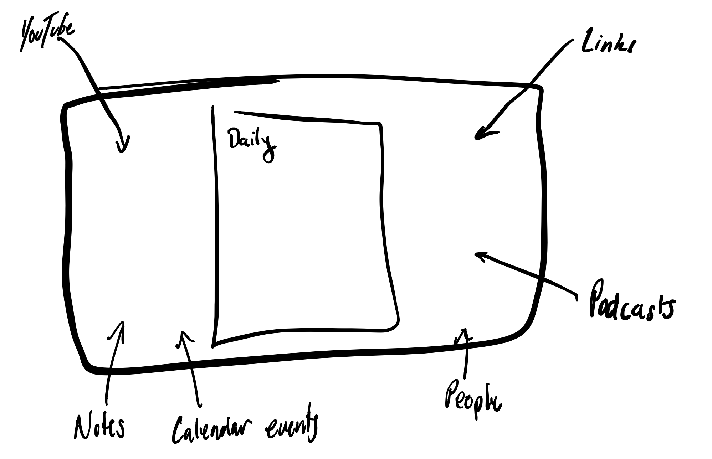

# Wednesday September 30^th^, 2020

## Summary

* PT Loop (bike)
* Finished *Understanding Comics* ... deserves some writing
* Created a bunch of twitter accounts
* Found and compared [Open Source Markdown Editors](open_source_md_editors.html)
* Call with [Dave](https://twitter.com/davegorum)
* More work on editors
* Run to park
* Hammock
* Run back
* Social Dilemma

## Morning Rambling and stuff

Hump DAY

ummm so after reading this morning I would like to explore a few things before doing anything of 'substance'

i want to create various twitter accounts for myself (an extension of the 'feed') that i then can reference or something. this might also force some thinking about arch with webhooks or some registration/message passing interface... one place dictates???

* notes - [@cjs_stream](https://twitter.com/cjs_stream)
* podcasts - [@cjs_podcast](https://twitter.com/cjs_podcasts)
* finances (pay for access to my twitter feed?) - [@cjs_financials](https://twitter.com/cjs_financials) [private]
  * multiple?
* books - [@cjs_books](https://twitter.com/cjs_books)
* people - [@cjs_people](https://twitter.com/cjs_people) [private]

Basically we want to start tweeting from the golang server. Lol I might do this tomorrow and see if I can hack it up really fast (at least for stream), podcasts will require reply and stuff too. 

explore markdown (open source) editors 

story in ch7 of *Understanding Comics* is absolutely fascinating

## [Open Source Markdown Editor Exploration](open_source_md_editors.html)

So I am looking to build on top of some existing Markdown editor to really improve my writing and publishing flow. Hopefully to get it to the point where someone else can do it without thinking.

Basically click the link above it should summarize a lot of options in a table. The writing I did was pretty ad-hoc and depended on how much I liked the library. Would like to clean this up at some point. For now it stands alone.

## Exploring what I really want in publishing tool

So this in words is. Multiple workspaces (daily, weekly, monthly for now). The workspace can be defined programatically (by a day). Generated when you come into the app (like Roam). It will be written in .md for the main page, but you can have a bunch of side pages. 

These are merely artifacts of the day but are intended to be [evergreen](https://notes.andymatuschak.org/Evergreen_notes). Especially since you should come back to them and include them in a daily just like any other note you might have included.

In addition to side pages you have all the events of your day. This means you should have all the tools and reminders at your fingertips to go and write about your day as well as attach fun things to the final document. Turn the day into a story. You should even be able to template to take advantage of these things and get metrics!

Also downloads should go in this day and perhaps never be seen again if I acted on that thing. Basically this enviornment is going to be my OS lol

Anyway this is just a thought, but this is feeling somewhat doable. I think we will need to start thinking about the actual arch of the system.

## Tomorrow

Okay so there are always 10000000 things I want to do, but a few options for tomorrow

* Stream -> Twitter
* Podcast -> Twitter
* Financials (Plaid) -> DB
* More about writing tool
* Research more about blockchain stuff mentioned by Dave 

### Other

Would really like to have some kind of macro like C. So I can define something then it gets expanded on processing. I don't really want to think about text substitution, or look at huge ugly syntax.

Definitely need to learn more about [CouchDB](https://docs.couchdb.org/en/stable/index.html)