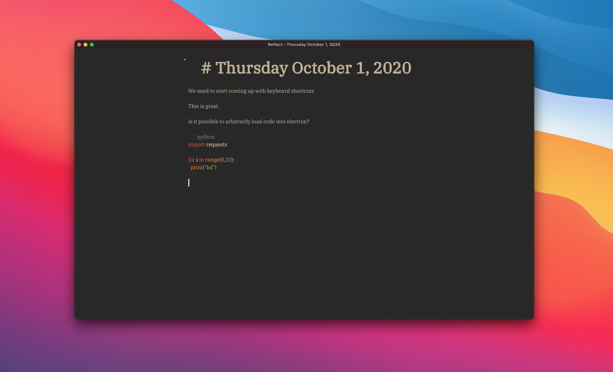

# Q4 2020 (Sept - December)

## Into the Unknown

**Table of Contents**

Wow. What a wild 4 months. 4 months of the unknown. 

If you'd like to skip to the reflection bit, feel free. It's at the bottom, however please take a look
through the rest of the writing, you might find something interesting :) 

Below will be a summary of everything that I worked on or did during this time. However since this is a
reflection I'd like to tackle that up front. However it was not written until after everything was done.

There is a theme that runs through this document. It is one of play, but also one of distraction.
Before getting into reflection and analysis here's a table of contents

## Quitting Qualcomm

Yep. I quit my job without much of a plan. Initially I thought 

## An Adventure in Openness

## Finding a DB (First Week)

Since one of the big things I want to work on is private data, I was trying to figure out a good way 
to manage all of my private data. Initially my plan was to write my own DB. However, this idea was
quickly abandoned in favor of Postgres. However I didn't want to use SQL directly. I've found it effective
but always a bit of a pain. 

I'd been looking in this area for a while, and eventually it looked like GraphQL and Hasura were my
best option to augment Postgres. Once all set up I migrated my Podcast and Notes apps to use this DB
in addition to the CoreData DB they were using. 

Once this was done, I got thinking about another project. To display my financials publicly.

## Conversations
* Kristen Dave
* Kristen Dave Jon
* Weiwei
* Jon
* Austin
* Morgan
* Adam
* Shep
* Alex
* Chandler
* All climbing peeps, Caroline, Katie in particular

## RBG Passing

The death of RBG was tragic to hear, for the future of the Supreme Court, minorities (yes!
not just Women) rights, and much more. One of my friends is going to law school, and one of her
favorite classes was Constitutional Law. I asked her what her favorite RBG cases were so I could
read the opinions. I read 3 cases intending to write about each. I managed to do so just for 
*Shelby County v Holder*, and partially for *Burwell v Hobby Lobby*

* *Shelby County v Holder* - [[marked up pdf](../../../scotus/shelby%20county%20v%20holder.pdf)] [[my analysis](../../../scotus/Shelby%20County%20v.%20Holder.html)]
* *Burwell v Hobby Lobby* - [[marked up pdf](../../../scotus/burwell%20v%20hobby%20lobby.pdf)] [[my analysis - partial](../../../scotus/Burwell%20v%20Hobby%20Lobby.html)]
* *US v Virginia* - [[marked up pdf](../../../scotus/us_v_virginia.pdf)]

## Financials (aka. [burrito.place](https://burrito.place))

One of the more interesting things to me is the idea of transparency. 

Beyond just transparency, with this project I wanted to play around with the idea of directly selling 
my data as well as creating an exchange.

* Transparency
* Selling Data
  * Giving up Data for Discount (effectively selling your data)
* Adjusting price based on wealth. Flattening wealth inequality curve

One of the main reasons this never got finished was that my main two credit cards were not easy to 
get data from. This effectively killed the project. It was certainly possible to get my data
from CapitalOne (see my analysis), but I don't think it was worth the time to continue to engineer 
such a fragile solution. Beyond this, my Apple Card is the only other card I use, which doesn't
look like you can pull data easily from (c'mon Apple). Neither were integrated with Plaid at the time
of writing which was what I was planning on using.

While this project never quite got off the ground, I still think it is quite an interesting concept.
I would like to revisit this at some point. Wether it be for financial data, or any of my data. This
is one aspect of the technology industry I think could use some change and has lots of potential. 

## Daily's

Started to get a system down in early September, however with a lot of manual labor. The plan from
the start was to automate as much as possible of this, and turn writing into a complete play space.
Having images, video, audio, links, code, tables, all play nicely with each other. And also be able
to reference anything in the DB at any time. Eventually augmented by NLP. 

To actually get moving I thought the best first step would be to take an existing Markdown editor
and augment it. Ideally something with a plugin system. [I found a bunch of open source ones and compared them](../../../day/sept30_2020/open_source_md_editors.html),
but none really fit the bill for me. Well.. VSCode did, and remains the choice today. However, at the
time I was adamant about creating my own. So I started to.

## Lobster Diving

yaaa

### Enter Reflect

Reflect was my first attempt to create a markdown editor. It was meant to combine all data sources and
automate the tasks I was doing on a daily basis to write and publish. It also needed VIM mode.

It was also my first try at using Electron. I found out pretty quickly it was relatively easy to build
something in Electron, however I wasn't totally wrapping my head around node/npm. Anyhow I quickly realized
I needed to get something to write text and code into. Since Markdown is technically code, and I wanted
some level of syntax highlighting I chose to use CodeMirror. Getting up and running with it was relatively
simple, but still required a full day or two of work to wrap my head around. It also started to get me
thinking about plugin architectures.

With reflect one of the main goals was to have a little tiny core editor piece, that handles all the rendering
and everything, but then data sources can create their own elements backed by data. You would just pass
the data and template to the main UI and it would render everything for you. It would also provide a neat
interface for you to pass data between plugins. That way you could wire up a bunch of views together directly
from the UI. It should allow data sources to be directly imported too, so you could just write code directly
in the editor and have it be previewed and running live.

This whole architecture seemed like a fun challenge and definitely required a lot of research. I was mostly
curious about how VSCode was doing their architecture under the hood, but digging through the code I got
lost very quickly. I would need to spend multiple days to understand it. I did find Hashicorp's architecture
and wrote some [notes on it](../../../day/oct6_2020/hashicorp_go_arch.html). Good things to know for the future. What I remember is things talking via sockets, then over tcp later or something.

#### CodeMirror 6 and Plugins

After tweeting, I thought I should move to CodeMirror 6 to get the latest and greatest. Plus TypeScript
support! I had no idea how to use TypeScript at the time, but sounded fannnncy. This led me to 
integrating CodeMirror 6 in reflect as opposed to 5 like I was using before. However this had one problem.
No VIM mode. This would not fly. There is not a VIM plugin for CodeMirror 6 yet (or at the time of me
needing one). So I started to try to write one. I did make some progress, however very slowly.

### Exit Reflect

Reflect was another project that got stalled, however is something I am still very interested in,
but would love to pick up another time.

## Climbing

In between all this, I was climbing a lot in the gym. I had two climbing partners and friends 
I met at Qualcomm so I was climbing with them when I could. 

I met Katie and Steven. This starts a whole other chapter.

I started to refine
the process to what it is today. It's quite smooth now for all kinds of publishing if you ask me.
----- detail ------ TODO

### Red Rock

## Living in a Van?

## Reflection

* A lot of hopping from project to project trying to find one that's a good fit

## Moving Forward

* Would like to pick something to focus on and stick to it. Regardless of other ideas coming into my head.
  * That means 3 months of dedication. I am writing this on Dec 18th, and I haven't quite found what that is going to be yet. This is something to be figured out by the New Year.
* Intention to write quality code.
  * I've gotten used to writing up some hacked up code
  * I can easily write better code, but got lazy. This might be impacting the projects longevity as well.