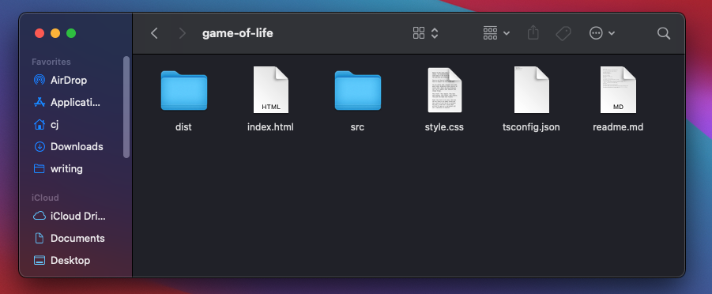

# Serve Subdomain (Google Domains) on IPFS

This is a quick and dirty guide to help you serve a website on IPFS.
Specifically from a domain where the DNS is controlled by Google.
My domain ([cjpais.com](cjpais.com)) is a Google Domain and I struggled
with some of the steps.

The first thing you will want to do is gather the files you want to host.
This could come from a SSG like Hugo, a React App that you've written,
or perhaps like me, just a pure HTML/JS/CSS page. In any case you 
will have some `index.html` which will be the root of what you serve.

This is what my directory looks like.

Without getting too much into the weeds of IPFS, it can allow you to
serve any static content if you add it to the network. However, someone
needs to host this content or it will not be accessible. That is where
'pinning' services come in. I used [Pinata](pinata.cloud).

After signing up under the *free* account you can upload your directory
of files.

After pinning, you can see my IPFS hash is
`QmXM71jqL2RkJsajPWnGJxqNUDgPgbHu6HVFHRx1bMwAAZ`. 
A gateway to the regular internet is required to actually access this
file. Fortunately Cloudflare hosts one. So you can see my website
with a crude version of Conway's Game of Life at
https://cloudflare-ipfs.com/ipfs/QmXM71jqL2RkJsajPWnGJxqNUDgPgbHu6HVFHRx1bMwAAZ/.

Cool! So you have some content on IPFS and you can even see it, even if from
an ugly URL. How do we connect a domain to it? For example since this is the
Game of Life I want it to be on a subdomain of my actual domain. Let's call
it `gol.cjpais.com`. Just replace `gol` and `cjpais.com` with your subdomain
and domain respectively.

To do this Cloudflare has some good [instructions](https://developers.cloudflare.com/distributed-web/ipfs-gateway/connecting-website), however they didn't quite
work for me.

So really all we need to do is add some DNS records on Google Domains.

For me that looked like:

* A record with the IPv4 Address for `cloudflare-ipfs.com`
* AAAA record with the IPv6 Address for `cloudflare-ipfs.com`
* TXT record named `_dnslink.<subdomain>` with value `dnslink=/ipfs/<hash>`

This differs from the Cloudflare instructions which say to use a CNAME record
instead of A and AAAA. However the CNAME did not resolve for me. This worked
out. [Thanks Lucas](https://lucaskohorst.com/posts/decentralizing-your-website/).

#### References

* https://lucaskohorst.com/posts/decentralizing-your-website/
* https://www.cloudflare.com/distributed-web-gateway/
* https://developers.cloudflare.com/distributed-web/ipfs-gateway/connecting-website