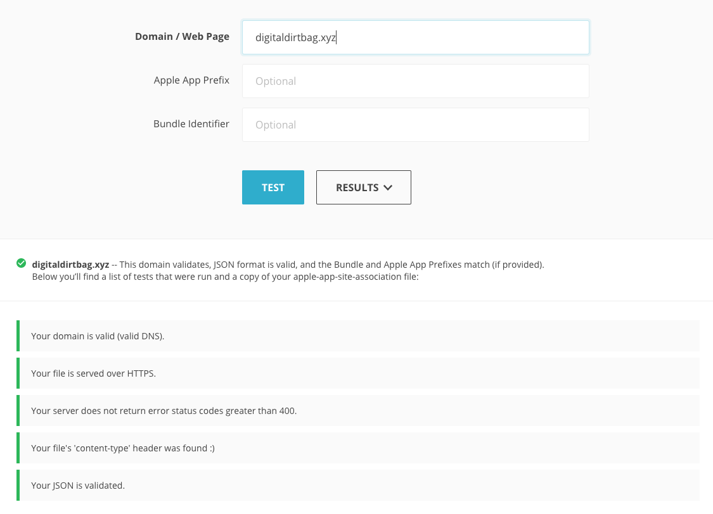

# Handling Universal Links in SwiftUI

*Last Updated: Nov 2020*

*iOS SDK 14.2*

I struggled for a long time to figure out how to implement Universal Links properly. 
In addition there was very little documentation on how you open into your app from a QR code. 
This guide serves as a way to implement the base level of Universal Link functionality as 
well as handling QR codes.

## Overview

[Universal Links](https://developer.apple.com/ios/universal-links/) allow you to redirect users
from a webpage directly into your app's context. It is applicable only for iOS devices. 
With Universal Links you can maintain the context the user previously had on the webpage
but give them a native experience.

By adding a specific file (`apple-app-site-association`) on your webserver, you can support
Universal Links relatively easily. When your app is downloaded the user's device will query
your server for this file. Once it's done this, any time the user visits one of the routes provided
in this file, they will be directed into your native experience.

**Steps to Implement**

1. Add Apple App Site Association (AASA)
   * Get Team ID
   * Validate AASA 
2. Add Entitlements to App
3. Use onOpenURL to handle Links
4. Use onContinueUserActivity to handle QR Codes
5. Handle Routing 
6. Testing Universal Links
   * Notes Link
   * Web Link
   * QR Link 

## Adding Apple App Site Association

Before working on the App at all we want to have everything set up for the app to support our 
Universal Link. The first thing to do is create the `apple-app-site-association` (AASA) and serve it.

For example [my AASA](https://digitaldirtbag.xyz/apple-app-site-association) looks like this:

```json
{
  "applinks": {
    "apps": [],
    "details": [
      {
        "appID": "UWFLB4GC25.com.pais.rockaholic",
        "paths": ["/route/*"]
      }
    ]
  },
  "activitycontinuation": {
    "apps": [
      "UWFLB4GC25.com.pais.rockaholic"
    ]
  }
}
```

Breaking this down you only need to do two things.

1. Change the `appID` to be your `TEAM_ID.APP_BUNDLE_ID`
   * My `TEAM_ID = UWFLB4GC25` 
   * My `APP_BUNDLE_ID = com.pais.rockaholic` 
2. Change the `paths` to be the URL's you want to treat as universal links.
   * I will be handling all paths starting with `route`
   * For more information see [Apple's Documentation](https://developer.apple.com/library/archive/documentation/General/Conceptual/AppSearch/UniversalLinks.html) (it's quite good)

The requirements for serving it are as follows:

* Have it named `apple-app-site-association`
* Have it served over HTTPS
* Have it served with the `Content-Type` header set to `application/json`
* Have it be valid JSON
* Have it served at the root directory or `/.well-known` directory

### Validating AASA

There are a few tools you can use to validate your AASA after you have it on your server.
Even if you validate your AASA you may run into some frustration, but it is a good thing
to check off your list.

The [Branch AASA Validator](https://branch.io/resources/aasa-validator/) is the best I found. 
Just put in your domain and it will check everything for you. You should see all green like the 
below if it's good!




[Apple has their own validation tool](https://search.developer.apple.com/appsearch-validation-tool), however it doesn't think my App is valid 🤷🏽‍♂️. I wouldn't recommend it. 
It just added to the confusion of the process.

### References

[Support Universal Links - Apple](https://developer.apple.com/library/archive/documentation/General/Conceptual/AppSearch/UniversalLinks.html)
