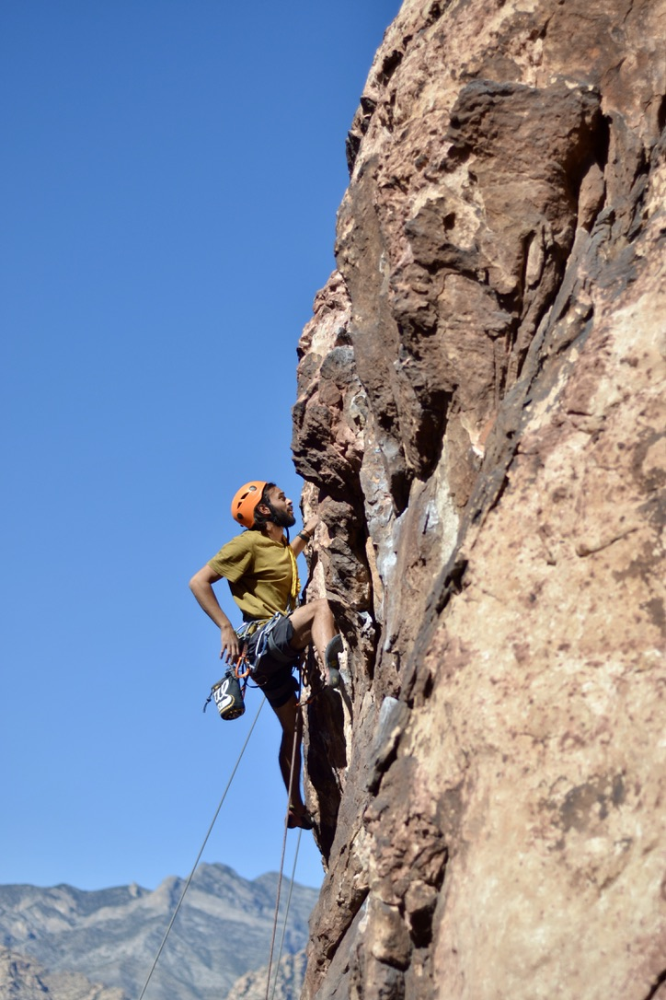
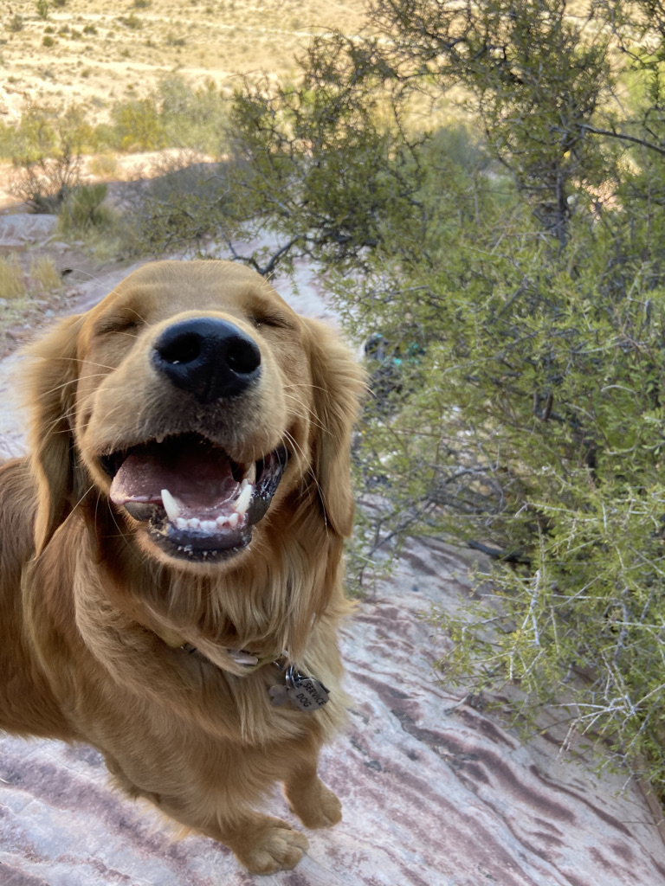
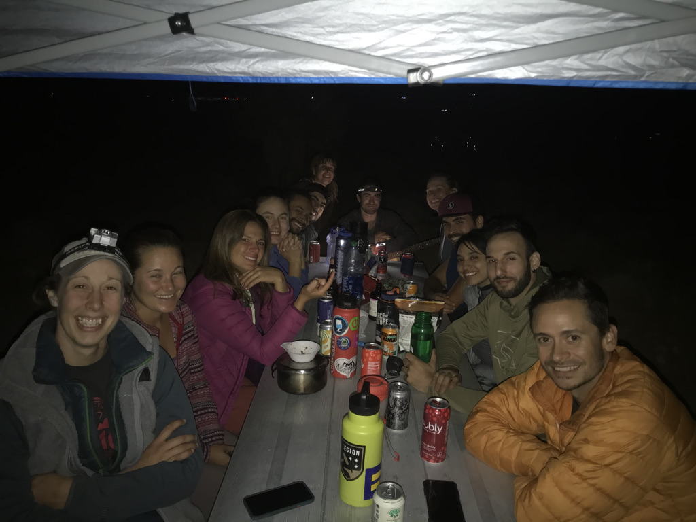
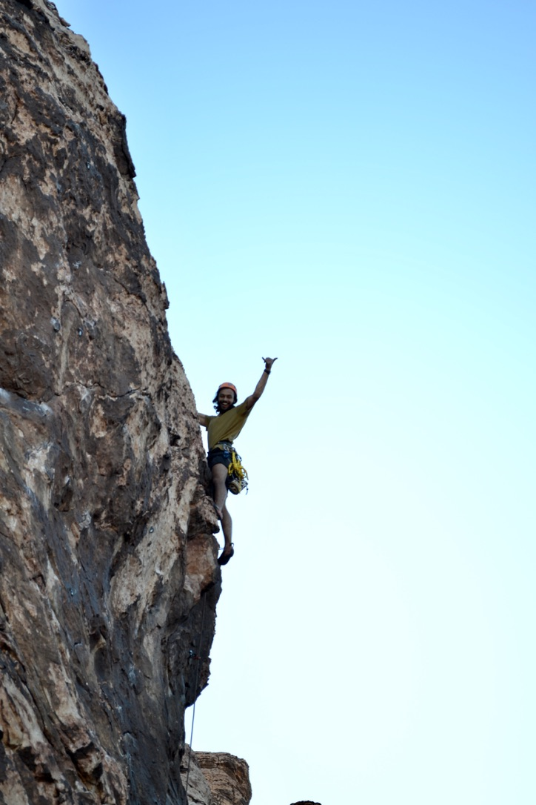
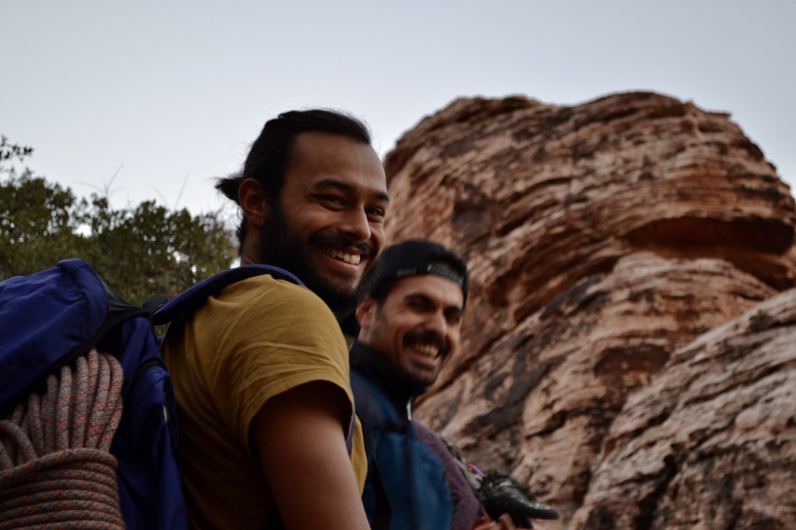
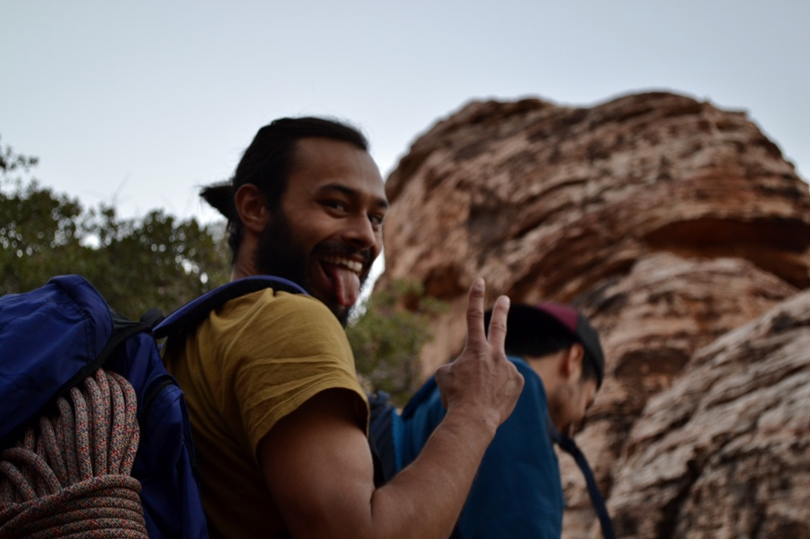
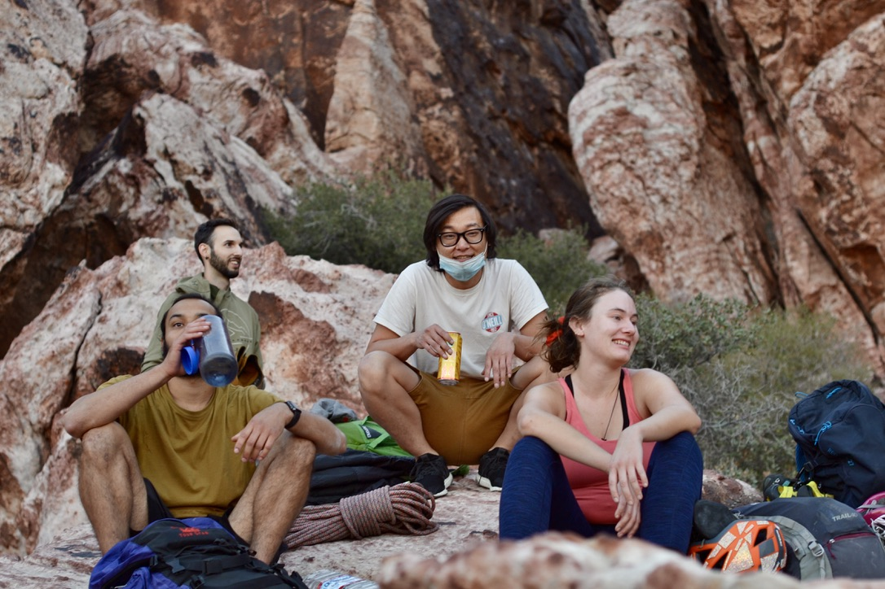
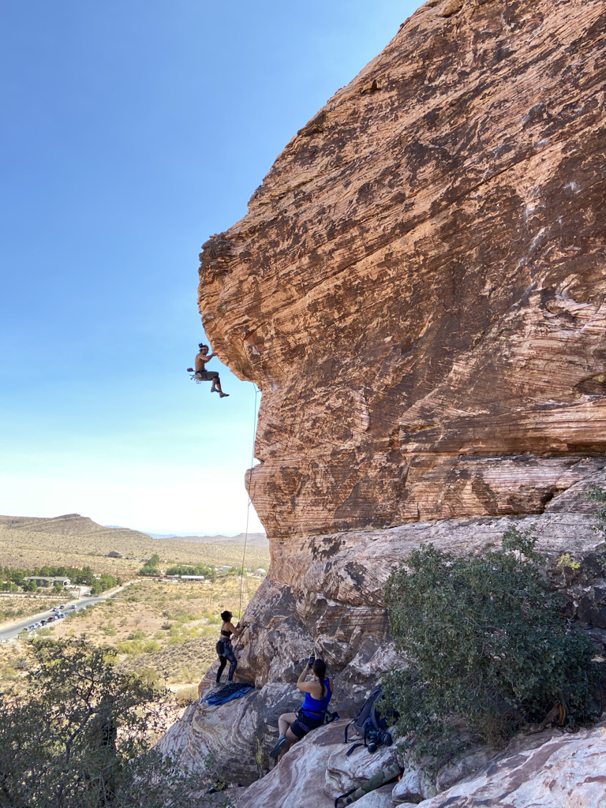
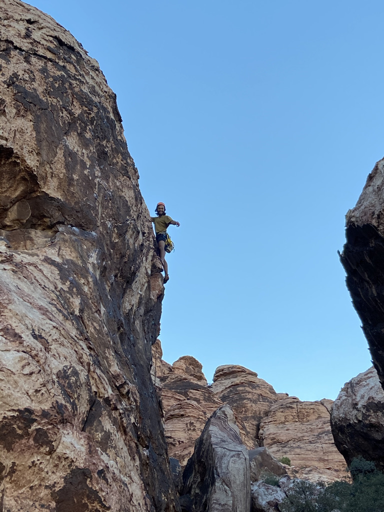

# Red Rock (October 2020)

## Climbing

### Saturday

Lots of climbing. Might have missed some climbs too.

#### [Civilization Crag](https://www.mountainproject.com/area/106686385/civilization-crag)

* Ming Dynasty (5.9+) - Lead. Flash. Set
* The Sun Never Sets (5.7) - Top Rope. Flash
* This is Sparta (5.9) - Top Rope. Flash
* Manifest Destiny (5.9+) - Top Rope. Flash
* Ming Dynasty (5.9+) - Lead. Flash. Clean
* Mongol Hoarde (5.10a) - Lead. Flash
* Byzantium (5.10b) - Top Rope. Flash
* Conquistador (5.10d) - Top Rope. 1 fall

#### [Child's Play Wall](https://www.mountainproject.com/area/114114205/childs-play-wall)

* Hide and Seek (5.7). Lead (one hand until last bolt). Flash
* Tag You're It (5.8). Lead. Flash. Clean.

### Sunday

#### [Cannibal Crag](https://www.mountainproject.com/area/105732024/cannibal-crag)

So much belaying :) 

* What's Eating You (Spicy 5.10a) - Lead. Hung @ First Bolt (Crux). Set.
* [Baseboy](https://www.mountainproject.com/route/105944432/baseboy) - (5.10+) - Top Rope. Rested (hung) at traverse section.
* 2x [Elbows of Mac and Ronnie](https://www.mountainproject.com/route/105944680/elbows-of-mac-and-ronnie) (5.11b) - Lots of fall at the crux. Aided over it. Rest was easy. Time to project the crux. Cleaned

## Photos

